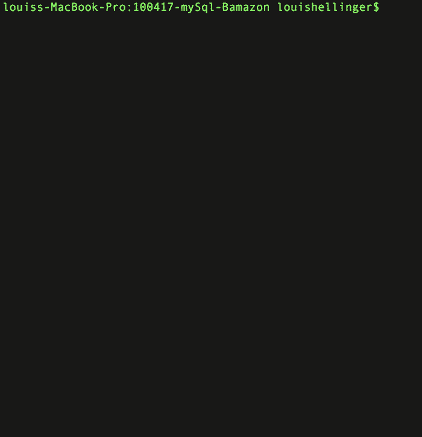
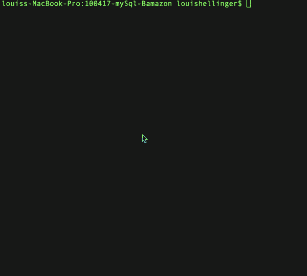

# Bamazon

### OVERVIEW
***

Bamazon is an interactive "shopping" node app using MYSQL and Node.JS. It also user these NPM packages: Inquirer, MySql, Colors and Columnify.

## Customer Experience
Allows users to view and shop all items in the store. The user is shown all of the items and can enter the item number and quantity to purchase. If the item is in stock, the user is presented with a confirmation and the total cost of the purchase. If the user selects an item that is not in stock, they will be directed to choose a different item. After the user is done shopping they can can exit out of the app. 

---

## Manager Experience
Allows users to view all items in the store, update inventory, and add new products. The Manager can select from five options: 
	* View Products for Sale
	* View Low Inventory Items
	* Add To Inventory
	* Add New Product 
	* Exit

The first option allows the manager to see a full list of all items.

The second option displays items that are low in inventory. Low inventory items have six units or less.

The third option allows the manager to add inventory to a specific item.

The fourth option is for creating a new product. This option uses Inquirer to collect all of the data for the new product.

The last option is simply an exit which closes the mysql connection and displays a message.

---

#### Creator:
***

Louis Hellinger <https://github.com/louisHellinger>

#### Technologies Used:
***

* Javascript
* nodeJS
* MySQL
* npm packages:
	- [mysql](https://www.npmjs.com/package/mysql)
	- [inquirer](https://www.npmjs.com/package/inquirer)
	- [colors/safe](https://www.npmjs.com/package/colors)
	- [columnify](https://www.npmjs.com/package/columnify)
---
